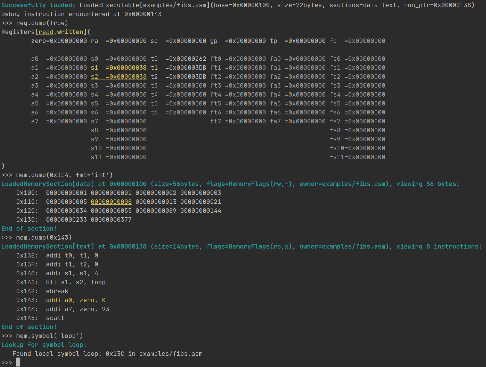

# RiscEmu - RISC-V (userspace) emulator in python

[](https://riscemu.readthedocs.io/en/latest/?badge=latest)

Implementing a basic RISC-V emulator, aimed at being easily extendable. Check out the docs at [readthedocs](https://riscemu.readthedocs.io/en/latest/index.html)
or [riscemu.datenvorr.at](https://riscemu.datenvorr.at/index.html).

This emulator contains:
* RISC-V Assembly parser
* RISC-V Assembly loader
* Emulation for parts of the basic RISC-V instruction set
* Naive memory emulator
* Basic implementation of some syscalls 
* A debugging environment

## Installation:

```bash
$ pip install riscemu
```

## Running simple Assembly:
A couple of basic assembly programs are provided inside `examples/`, such as [`hello-world.asm`](examples/hello-world.asm).

You can run it by typing `python -m riscemu examples/hello-world.asm`. It will produce output similar to:
```
[MMU] Successfully loaded: LoadedExecutable[examples/hello-world.asm](base=0x00000100, size=24bytes, sections=data text, run_ptr=0x00000110)
[CPU] Started running from 0x00000110 (examples/hello-world.asm)
Hello world

Program exited with code 0
```

The [`read` syscall](docs/syscalls.md) defaults to readline behaviour. Reading "true chunks" (ignoring newlines) is currently not supported.  

See the docs on [asembly](docs/assembly.md) for more detail on how to write assembly code for this emulator.
See the [list of implemented syscalls](docs/syscalls.md) for more details on how to syscall.

Currently, symbols (such as `main` or `loop`) are looked-up at runtime. This allows for better debugging, I believe.

Basic IO should work, as open, read, write and close are supported for stdin/stdout/stderr and even aribtrary file paths (if enabled)

When trying to run an assembly program, the emulator first tries to find a symbol named `_start`, then a symbol named `main`. if both
symbols were not found in the file, it simply starts at the beginning of the `.text` segment.

## Using the CLI:
*Current CLI is not final, options may change frequently until a stable version is reached*

This is how the interface is used:

```
usage: riscemu [-h] [--options OPTIONS] [--syscall-opts SYSCALL_OPTS] [--instruction-sets INSTRUCTION_SETS] [--stack_size stack-size] file.asm [file.asm ...]


OPTIONS and SYSCALL_OPTIONS is a list of comma-separated flags that will be enabled

--options OPTIONS: (-o)
disable_debug           Disable the ebreak and sbreak instructions
no_syscall_symbols      Don't make syscall symbols globally available
fail_on_ex              Do not launch an interactive debugger when the CPU loop catches an exception
add_accept_imm          accept "add rd, rs, imm" instructions, even though they are not standard

--syscall-opts SYSCALL_OPTS: (-so)
                        Options to control syscall behaviour
fs_access               Allow access to the filesystem
disable_io              Disallow reading/writing from stdin/stdout/stderr

--instruction-sets INSTRUCTION_SETS: (-is)
                        A list of comma separated instruction sets you want to load:
                        Currently implemented: RV32I, RV32M
``` 

If multiple files are specified, all are loaded into memeory, but only the last one is executed. This might be improved 
later, maybe the `_init` section of each binary is executed before the main loop starts? 

If `stack_size` is greater than zero, a stack is allocated and initialized, with the `sp` register pointing to the end of the stack.


## Debugging
Debugging is done using the `ebreak` (formerly `sbreak`) instruction, which will launch a debugging session if encountered.
See [docs/debugging.md](docs/debugging.md) for more info.




## The source code:
Check out the [documentation](https://riscemu.readthedocs.io/en/latest/riscemu.html).

## Accessing local documentation:
To generate your local documentation, first install everything in `sphinx-docs/requirements.txt`. Then run `./generate-docs.sh`, which will 
generate and make all doc files for you. Finally, you can open the docs locall by runnint `open sphinx-docs/build/html/index.html`.

## Resources:
  * Pseudo ops: https://www.codetd.com/article/8981522
  * detailed instruction definition: https://msyksphinz-self.github.io/riscv-isadoc/html/rvi.html#add
  * RISC-V reference card: https://www.cl.cam.ac.uk/teaching/1617/ECAD+Arch/files/docs/RISCVGreenCardv8-20151013.pdf
  
## TODO:
 * Currently registers don't enforce 32 bit (no overflows etc)
 * Correctly handle 12 and 20 bit immediate (currently not limited to bits at all)
 * Add a cycle limit to the options and CPU to catch infinite loops
 * Move away from `print` and use `logging.logger` instead
 * Writer proper tests
 
